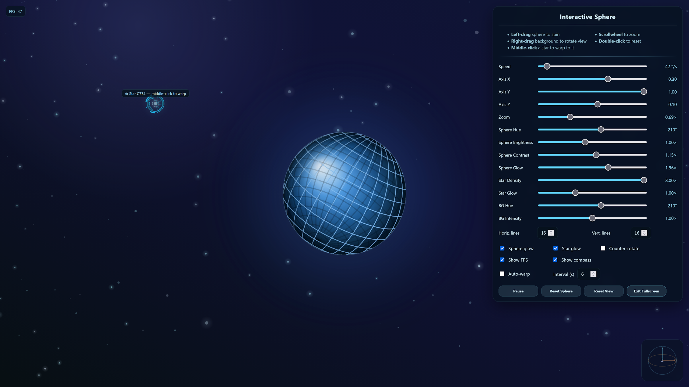

# html-sphere

Interactive rotating sphere in HTML, CSS, and JavaScript — check the [live demo right here](https://tz-dev.github.io/html-sphere/).



## Features

- Interactive rotating sphere rendered on `<canvas>`
- Adjustable global rotation speed
- Weighted X / Y / Z axis controls
- Mouse drag to rotate the sphere manually
- Right-click drag to rotate the view
- Mouse wheel and slider zoom
- Adjustable sphere color hue
- Adjustable horizontal and vertical line count
- Adjustable star density
- Optional sphere glow
- Optional star glow
- Optional counter-rotating background stars
- Optional compass widget
- Star hover label
- Middle-click on a star to trigger a warp transition
- Warp transition with camera movement, sphere drift, hue randomization, and new axis settings
- Auto-hiding overlay and cursor after inactivity
- Fullscreen mode

## Controls

- **Left drag on sphere**: rotate the sphere manually
- **Right drag on background**: rotate the view
- **Mouse wheel**: zoom in / out
- **Middle click on a star**: warp to the selected star
- **Double click on sphere**: reset sphere orientation
- **Pause**: pause automatic motion
- **Reset Sphere**: reset only the sphere rotation
- **Reset View**: reset the full scene

## Tech

- HTML
- CSS
- Vanilla JavaScript
- Canvas 2D

## Project structure

```text
html-sphere/
├── index.html
├── css/
│   └── style.css
├── js/
│   └── script.js
└── img/
    └── screenshot.png
````

## Run locally

Just open `index.html` in a browser.

For development, using a local server is recommended.

Example with VS Code Live Server or any simple static file server.

## Notes

This project is a lightweight interactive graphics demo built without external libraries.

The sphere rendering, rotation logic, warp transitions, background stars, compass, glow effects, and UI are all handled in plain JavaScript and CSS.

## License

GNU General Public License v3.0
