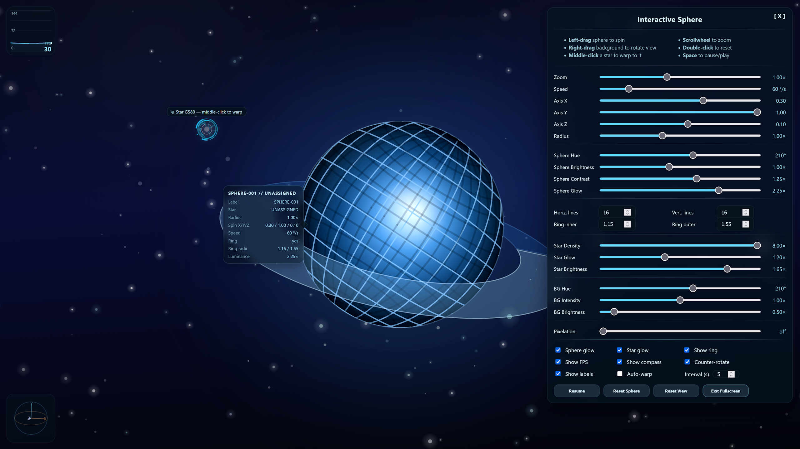
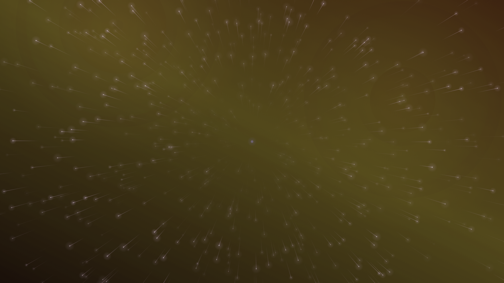
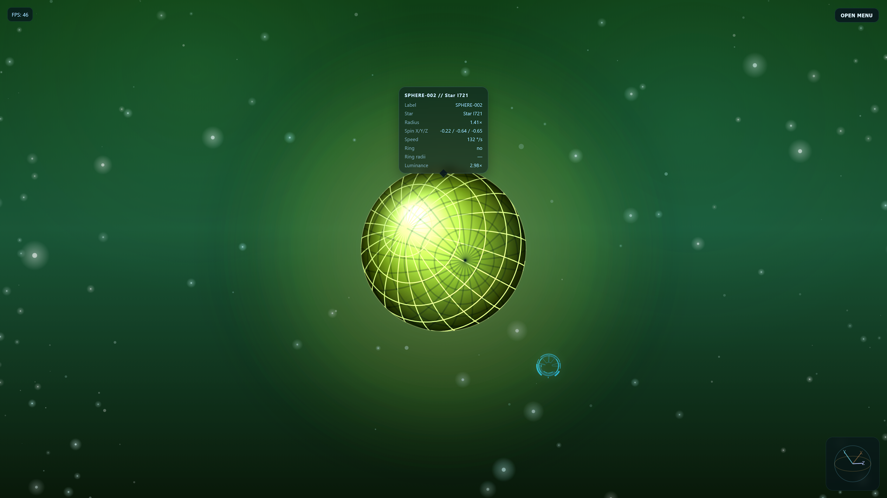

# html-sphere

Interactive rotating sphere in HTML, CSS, and JavaScript — check the [live demo right here](https://tz-dev.github.io/html-sphere/).







## Features

### Sphere and scene

The project renders an interactive wireframe-like sphere on a `<canvas>` element and combines automatic motion with direct user input. Rotation can be tuned globally and distributed across the X, Y, and Z axes, which makes it possible to create everything from calm drifting motion to more dynamic spin patterns.

The sphere appearance is configurable in both structure and style. Its hue can be adjusted, the horizontal and vertical line counts can be changed to alter how dense or minimal the mesh looks, and the sphere radius can be scaled independently from zoom. Zoom itself is available both through the mouse wheel and a UI slider for fast navigation.

An optional planetary ring can be enabled to give the scene a more stylized orbital look. The ring size is configurable through inner and outer radius controls, with sensible constraints so the inner radius stays compatible with the sphere size. Its motion stays visually tied to the sphere by rotating in the same general direction at half speed during normal animation, while warp transitions can also reorient it to a new random spatial alignment.

### Background and effects

The surrounding scene includes a starfield whose density can be adjusted to create anything from a sparse backdrop to a busy space environment. Additional visual effects such as sphere glow and star glow can be enabled individually, with separate intensity controls for each.

To further shape the overall look, the scene supports sphere brightness and contrast adjustments as well as optional counter-rotating stars for added depth and motion. The background is controlled independently through dedicated hue, intensity, and brightness settings, so the stage can be tuned without affecting the sphere or the stars rendered on the canvas.

Warp transitions add movement and variation to the experience. During a warp, the selected star is smoothly centered toward the canvas midpoint, the sphere drifts across the scene, and several scene parameters can be randomized. These include sphere hue, axis weighting, speed, sphere brightness, contrast, sphere radius, ring configuration, and background hue, intensity, and brightness. Background slider values animate during the warp, so the UI always reflects the live scene state.

### Interface

The UI includes a set of optional overlays and utilities designed to support both exploration and performance monitoring. A compass widget can be shown to indicate orientation, and an FPS display can be enabled for performance feedback.

Stars can be interacted with directly through hover labels and warp targeting. The interface also supports fullscreen mode with synchronized button state, auto-warp mode with configurable timing, and automatic hiding of the overlay and custom cursor after inactivity for a cleaner presentation.

An optional information label panel can be displayed near the sphere. It shows the current sphere ID, the last warped star label, radius, spin axis values, speed, glow intensity, and ring configuration. The panel is positioned dynamically around the sphere and includes a directional pointer toward the object.

## Controls

### Mouse interaction

| Input | Action |
|---|---|
| **Left drag on sphere** | Rotate the sphere manually |
| **Right drag on background** | Rotate the view |
| **Mouse wheel** | Zoom in / out |
| **Middle click on a star** | Warp to the selected star |
| **Double click on sphere** | Reset sphere orientation |

### Buttons and toggles

| Control | Action |
|---|---|
| **Pause** | Pause automatic motion |
| **Reset Sphere** | Reset only the sphere rotation |
| **Reset View** | Reset the full scene |
| **Fullscreen** | Enter or leave fullscreen mode |
| **Show FPS** | Toggle the FPS display |
| **Show compass** | Toggle the compass widget |
| **Show labels** | Toggle the sphere information label panel |
| **Sphere glow** | Toggle sphere glow rendering |
| **Star glow** | Toggle star glow rendering |
| **Counter-rotate** | Toggle counter-rotating background stars |
| **Show ring** | Toggle ring rendering |
| **Auto-warp** | Automatically warp to random visible stars |

### Sliders and inputs

| Control | Action |
|---|---|
| **Speed** | Control the overall automatic rotation speed |
| **Axis X / Y / Z** | Control weighted spin contribution per axis |
| **Radius** | Control the sphere size |
| **Zoom** | Control camera zoom level |
| **Color Hue** | Control the sphere color palette |
| **Brightness** | Control sphere brightness |
| **Contrast** | Control sphere contrast |
| **Sphere Glow** | Control sphere glow intensity |
| **Star Density** | Control the number of background stars |
| **Star Glow** | Control star glow intensity |
| **Background Hue** | Control background color tone |
| **Background Intensity** | Control background color intensity |
| **Background Brightness** | Control background brightness only |
| **Horiz. lines** | Set the number of horizontal sphere lines |
| **Vert. lines** | Set the number of vertical sphere lines |
| **Ring inner** | Set the ring inner radius multiplier |
| **Ring outer** | Set the ring outer radius multiplier |
| **Auto-warp interval** | Set the delay between automatic warps in seconds |

## Tech

- HTML
- CSS
- Vanilla JavaScript
- Canvas 2D

## Project structure

```text
html-sphere/
├── index.html
├── css/
│   └── style.css
├── js/
│   └── script.js
└── img/
    ├── screenshot00.png
    └── screenshot01.png
````

## Run locally

Just open `index.html` in a browser.

## Notes

This project is a lightweight interactive graphics demo built without external libraries.

The sphere rendering, ring rendering, rotation logic, warp transitions, background stars, compass, glow effects, scene post-processing, auto-warp logic, information labels, custom cursor behavior, and UI are all handled in plain JavaScript and CSS.

Warp transitions can randomize both sphere and stage settings, including ring presence, ring size, ring orientation, and background values. Manual and automatic warps use the same transition system, keeping the visual behavior consistent.

## License

GNU General Public License v3.0
